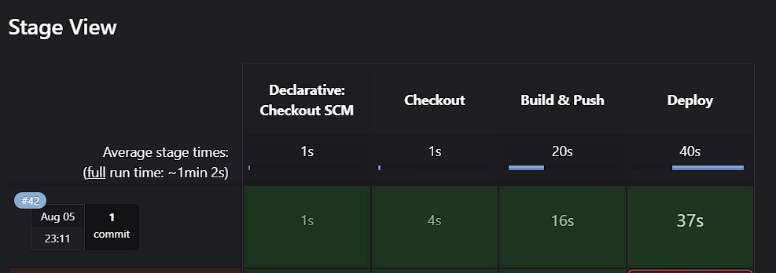
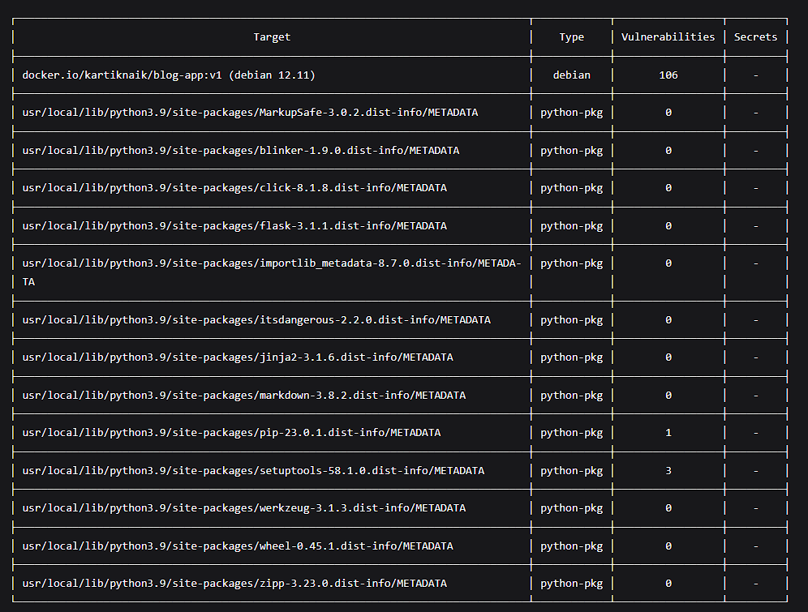

# 📝 Flask Markdown Blog with Jenkins CI/CD, Docker & Trivy

A minimal Flask-based Markdown blog application with end-to-end CI/CD automation using Jenkins, Docker, and Trivy vulnerability scanning. This project demonstrates a secure and automated container lifecycle including image scanning and controlled deployment.

---

## 🌟 Key Features

- 🧾 Markdown-based blog rendering with Flask
- 🐳 Multi-stage Docker build for optimized image size
- 🔁 Jenkins pipeline with these stages:
  - ✅ Git Checkout
  - 🔨 Docker Build & Push to Docker Hub
  - 🛡️ Trivy Image Scan for vulnerabilities
  - 🚀 Temporary Deployment (30 seconds) using container name
- 🔐 Secure secrets management in Jenkins

---

## 📁 Project Structure

```
.
├── app.py
├── requirements.txt
├── Dockerfile
├── Jenkinsfile
├── posts/
│   └── sample.md
├── templates/
│   └── index.html
└── static/
    └── style.css
```

---

## 🧪 Technologies Used

- Python 3.9 (Flask)
- Docker & Docker Hub
- Jenkins (Declarative Pipeline)
- Trivy (Image Vulnerability Scanning)
- GitHub Webhooks

---

## 🐳 Docker Multi-Stage Build

Dockerfile uses multi-stage to separate build and runtime environments.

```Dockerfile
FROM python:3.9 AS builder
WORKDIR /app
COPY requirements.txt .
RUN pip install --no-cache-dir -r requirements.txt

FROM python:3.9-slim
WORKDIR /app
COPY --from=builder /usr/local/ /usr/local/
COPY . .

CMD ["python3", "app.py"]
```

---

## ⚙️ Jenkins CI/CD Pipeline

### Pipeline Stages

1. **Checkout**
   ```groovy
   git branch: 'main', url: 'https://github.com/KARTIKNAIK18/jenkins-pipeline.git'
   ```

2. **Build & Push**
   ```bash
   docker build -t $DOCKER_USER/blog-app:$IMAGE_TAG .
   echo $DOCKER_PASS | docker login -u $DOCKER_USER --password-stdin
   docker push $DOCKER_USER/blog-app:$IMAGE_TAG
   ```

3. **Trivy Scan**
   ```bash
   docker run --rm aquasec/trivy image --severity CRITICAL,HIGH $DOCKER_USER/blog-app:$IMAGE_TAG || true
   ```

4. **Temporary Deploy**
   ```bash
   docker run -d --name blog_app_temp -p 5000:5000 $DOCKER_USER/blog-app:$IMAGE_TAG
   sleep 30
   docker stop blog_app_temp && docker rm blog_app_temp
   ```

---

## 🔐 Jenkins Secret Management

Create a credential (type: Username & Password) in Jenkins:

- **ID**: `docker-cred`
- Used in `withCredentials` block

```groovy
withCredentials([usernamePassword(
    credentialsId: 'docker-cred',
    usernameVariable: 'DOCKER_USER',
    passwordVariable: 'DOCKER_PASS')]) {
    // docker commands
}
```

---

## 🔄 GitHub → Jenkins SCM Webhook

1. Jenkins → Project → **Configure** → Enable ✅ “GitHub hook trigger for GITScm polling”  
2. GitHub → Repo → **Settings → Webhooks**  
   - URL: `http://<your-jenkins>/github-webhook/`
   - Content type: `application/json`
   - Trigger: ✅ Push events only

This allows automatic builds on every push to `main`.

---

## 📸 CI/CD Workflow Screenshots


## 🪪 Trivy Scan Report




---

## 🐳 Docker Usage

### Manual Build & Run

```bash
docker build -t blog-app:v1 .
docker run -p 5000:5000 blog-app:v1
```

---

## 💻 Local Development

```bash
git clone https://github.com/KARTIKNAIK18/jenkins-pipeline.git
cd jenkins-pipeline
pip install -r requirements.txt
python3 app.py
```

Visit: http://localhost:5000

---

## 🛡️ Trivy Manual Scan

```bash
docker pull kartiknaik/blog-app:v1
docker run --rm aquasec/trivy image kartiknaik/blog-app:v1
```

---

## 📤 Output Example


The app renders this response in HTML via Flask.

---

## 📜 Logs & Jenkins Summary

| Stage       | Logs Include                                  |
|-------------|-----------------------------------------------|
| Checkout    | Git commit hash, file list                    |
| Build & Push| Docker layer caching, image ID, push status  |
| Scan        | Trivy CRITICAL & HIGH issues summary          |
| Deploy      | Container ID, app boot logs, auto stop logs   |

---

## 👨‍💻 Author

**Kartik Naik**  
GitHub: [@KARTIKNAIK18](https://github.com/KARTIKNAIK18)  
Docker Hub: [@kartiknaik](https://hub.docker.com/u/kartiknaik)

---

## 📄 License

This project is licensed under the [MIT License](LICENSE).
